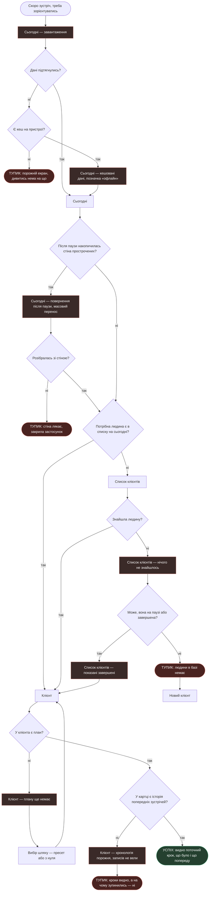
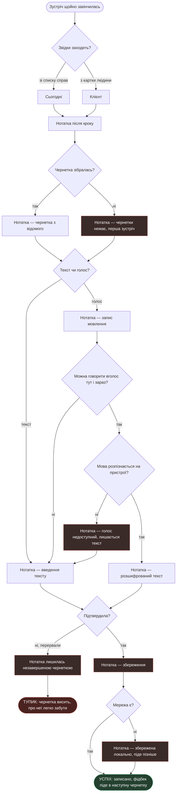

# User flows

Чернетка 2026-09-24. Екрани — зі [`sitemap.md`](sitemap.md), jobs —
з [`research/jtbd.md`](research/jtbd.md).

**Як читати:** `[прямокутник]` — екран або його стан · `{ромб}` — рішення
· `([овал])` — початок і кінець. Дії — підписи на стрілках, не вузли.

---

# MAIN JOB — «На чому ми зупинились і що далі»

> Коли я веду клієнта вже кілька місяців, я хочу в будь-який момент бачити,
> на чому ми зупинились і що я маю зробити далі, щоб не починати кожну
> зустріч із пригадування.

Персона: **P1**, та, що переросла нотатки.

**Рішення в цьому потоці**

1. *Дані підтягнулись?* — якщо ні, дивимось на кеш.
2. *Є кеш на пристрої?* — §6 брифу обіцяє роботу офлайн. Кешу немає лише
   при першому запуску без мережі.
3. *Після паузи накопичилась стіна прострочених?* — окрема гілка: повернення
   після відпустки може обірвати шлях ще до пошуку клієнта.
4. *Потрібна людина є в списку на сьогодні?* — короткий шлях в один тап
   проти довгого у два.
5. *Знайшла людину?* — пошук у списку.
6. *Може, вона на паузі або завершена?* — за замовчуванням показуємо активних,
   тож завершений клієнт у пошуку не з'явиться.
7. *У клієнта є план?* — клієнт може існувати без плану.
8. *У картці є історія попередніх зустрічей?* — **ядро цього job**, див. нижче.

**Стани**

- **Завантаження**, **офлайн із кешем** — перший екран не буває порожнім.
- **Повернення після паузи** — стіна прострочених із масовим переносом.
- **Нічого не знайшлось** — найчастіша причина не помилка пошуку, а те,
  що клієнт не активний.
- **Показані завершені** — знятий фільтр, не окремий екран.
- **Плану ще немає** — картка є, орієнтуватись нема по чому.
- **Хронологія порожня** — найтихіший стан у всьому потоці.

**Тупики**

- **Перший запуск без мережі.** Єдиний гучний: показати нема чого.
- **Стіна прострочених лякає.** Людина відкрила після відпустки, побачила
  сорок пунктів і вийшла, так і не дійшовши до клієнта.
- **Людини в базі немає.** Вихід один — завести. Але якщо фахівець був певний,
  що вона там є, це момент втрати довіри.
- **Кроки видно, а контексту немає.** Див. нижче.

> ### Залежність, яку виявив цей потік
>
> Main job просить побачити, **на чому ми зупинились**. План відповідає тільки
> на «що далі» — він показує кроки й терміни. На «що було» відповідає
> **хронологія**, а вона наповнюється лише нотатками після зустрічей.
>
> Отже **main job виконується тільки тоді, коли раніше виконувався R5**.
> Фахівець, який три місяці не писав нотаток, відкриє картку й побачить
> список кроків без жодного сліду розмов.
>
> Наслідок для проєктування: стан «хронологія порожня» не можна малювати
> як звичайний empty. Він має пояснювати причину й вести до першого запису,
> інакше продукт мовчки не виконує свою головну обіцянку.

---

# R5 — «Записати, поки не забула»

> Коли зустріч щойно закінчилась і все ще свіже в голові, я хочу відразу
> записати головне, щоб за тиждень не згадувати, про що ми домовились.

Персона: **[?]** — підкріплено цитатою, носія не визначено.
Саме цей job наповнює хронологію, від якої залежить main job.

**Рішення в цьому потоці**

1. *Звідки заходить?* — два входи, обидва з глобальної навігації.
2. *Чернетка зібралась?* — на першій зустрічі будувати нема з чого.
3. *Текст чи голос?* — вибір у кожному записі, не в налаштуваннях.
4. *Можна говорити вголос тут і зараз?* — салон, зал, коворкінг. Голос
   відпадає не через техніку, а через людей поруч.
5. *Мова розпізнається на пристрої?* — відкрите питання §13 брифу про
   українську офлайн.
6. *Підтвердила?* / *Мережа є?* — закриття запису й офлайн-черга.

**Стани**

- **Чернетки немає** — перша зустріч, порожнє поле замість чорновика.
- **Голос недоступний** — тиха відмова в текст, без екрана помилки.
- **Збереження** і **локальна черга** — запис не втрачається без мережі.

**Тупик**

- **Незавершена чернетка.** Перервали, вийшла. Запис лишився, але про нього
  легко забути — а це саме той контекст, заради якого існує продукт.
  І саме він потім не з'явиться в хронології для main job.

---

# R1 — «Переграти план, а не заводити новий»

> Коли клієнт посеред роботи передумав, я хочу змінити те, що попереду,
> щоб не заводити ще один окремий план і не тримати в голові, який із них
> тепер чинний.

Персона: **немає**. Ключова ставка продукту без знайденого носія.

**Рішення в цьому потоці**

1. *Що робить із кроком?* — три джерела: викинути, скласти вручну, узяти
   з іншого шаблону.
2. *Є придатний шаблон?* — у новачка власних шаблонів немає за визначенням.
3. *Ще зміни?* — петля: перебудова це серія дій, не одна.
4. *Підтвердила перебудову?* — вхід і вихід із режиму свідомі.

**Стани**

- **Пройдене замкнене** — правило, не помилка. Так само зроблено
  в CoachAccountable.
- **Шаблонів немає** — падаємо в ручне складання, не в глухий кут.
- **План без змін** — вихід без підтвердження нічого не ламає.

**Тупик**

- **Вийшла, не підтвердивши.** Клієнт передумав, план старий, робота йде
  не тим шляхом. Небезпечно тим, що виглядає нормально: жодної помилки
  на екрані немає.

---

# R7 — «Почати сьогодні, а не через тиждень»

> Коли я нарешті беруся навести лад у своїх клієнтах, я хочу почати цього ж
> вечора, щоб не витратити тиждень на налаштування й не кинути на півдорозі.

Персона: **[?]**. Закриває найризикованішу гіпотезу H4 — порожній старт.

**Рішення в цьому потоці**

1. *Це перший клієнт?* — перший запуск окремий стан, не той самий порожній
   список.
2. *Бере готовий пресет?* — рівноправна розвилка, як у Universe
   (`скрін: mobbin-search-universe-template-or-start-blank`), а не «пропустити».
3. *Є придатний пресет?* — власних шаблонів на старті немає, лишаються
   готові пресети продукту.
4. *Додала хоч один крок?* — точка, де людина або входить у продукт, або ні.

**Стани**

- **Перший запуск** — найризикованіший екран продукту, гіпотеза H4.
- **План порожній, кроки вручну** — стан, з якого легко піти нічого не зробивши.
- **Шаблонів немає** — у новачка їх немає за визначенням.

**Тупик**

- **Клієнт без плану.** Людина завела клієнта, не додала жодного кроку —
  і він **ніколи не з'явиться в «Сьогодні»**, бо там показуються кроки
  з термінами.

---

# Що видно з усіх чотирьох

**Main job залежить від R5.** «На чому ми зупинились» бере відповідь
із хронології, а хронологію наповнюють нотатки. Якщо R5 не виконувався,
головний job не виконається — при цілком справному плані. Це найважливіше,
що дало це малювання.

**Невидимість повторюється у двох потоках.** Клієнт без плану (R7)
і хронологія без записів (MAIN JOB) — один і той самий корінь: об'єкт існує,
але продукт про нього мовчить, бо порожній.

**П'ять із семи тупиків мовчазні.** Ні в «хронології порожній», ні
в «клієнті без плану», ні в «незавершеній чернетці», ні в «вийшла,
не підтвердивши», ні в «людини в базі немає» немає жодної помилки на екрані.
Усе виглядає справним.

**Голос має дві гілки відмови, не одну.** Технічну — мова не розпізнається
офлайн (§13 брифу). І людську — поруч люди, вголос говорити незручно.
Друга важливіша: вона спрацьовує частіше й не лікується технікою.
