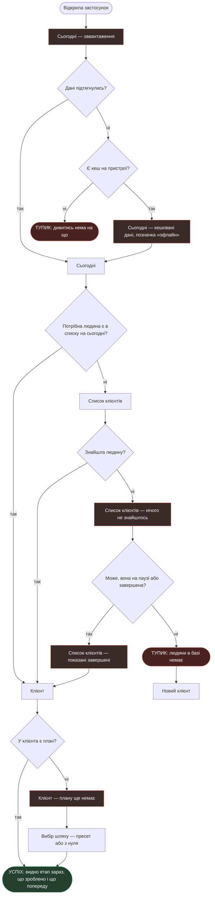
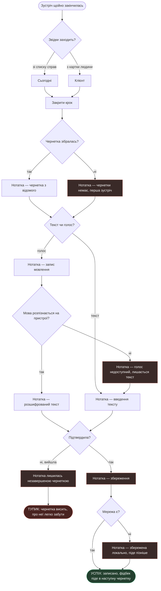
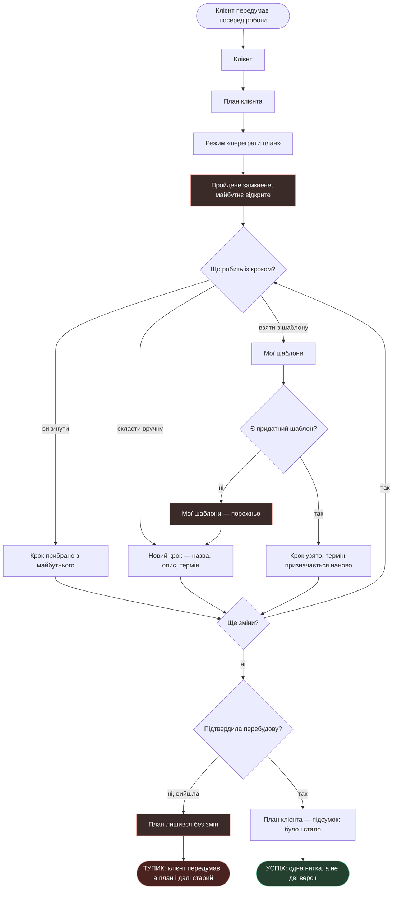

# User flows

Чернетка 2026-09-22. Екрани — зі [`sitemap.md`](sitemap.md), jobs —
з [`research/jtbd.md`](research/jtbd.md).

**Як читати:** `[прямокутник]` — екран або його стан · `{ромб}` — рішення
· `([овал])` — початок і кінець. Червоним — стани й тупики, зеленим — успіх.

---

# MAIN JOB — «На чому ми зупинились і що далі»

> Коли я веду клієнта вже кілька місяців, я хочу в будь-який момент бачити,
> на чому ми зупинились і що я маю зробити далі, щоб не починати кожну
> зустріч із пригадування.

Персона: **P1**, та, що переросла нотатки.

**Рішення в цьому потоці**

1. *Дані підтягнулись?* — якщо ні, дивимось, чи є кеш.
2. *Є кеш на пристрої?* — §6 брифу обіцяє роботу офлайн через локальний кеш.
   Кешу немає тільки при першому запуску без мережі.
3. *Потрібна людина є в списку на сьогодні?* — короткий шлях в один тап
   проти довгого у два.
4. *Знайшла людину?* — пошук у списку.
5. *Може, вона на паузі або завершена?* — за замовчуванням показуємо активних,
   тож завершений клієнт у пошуку не з'явиться.
6. *У клієнта є план?* — клієнт може існувати без плану, якщо його завели
   й покинули.

**Стани**

- **Завантаження** — перший екран не може бути порожнім.
- **Офлайн, кешовані дані** — показуємо з позначкою, не ховаємо.
- **Нічого не знайшлось** — головна причина зазвичай не в помилці пошуку,
  а в тому, що клієнт не активний.
- **Показані завершені** — не окремий екран, а знятий фільтр.
- **Плану ще немає** — картка є, main job не закривається.

**Тупики**

- **Перший запуск без мережі.** Кешу немає, показати нічого. Єдиний випадок,
  коли застосунок безсилий.
- **Людини в базі немає.** Вихід один — завести. Але якщо фахівець був певний,
  що вона там є, це момент втрати довіри.

---

# R5 — «Записати, поки не забула»

> Коли зустріч щойно закінчилась і все ще свіже в голові, я хочу відразу
> записати головне, щоб за тиждень не згадувати, про що ми домовились.

Персона: **[?]** — підкріплено цитатою, але носія не визначено.

**Рішення в цьому потоці**

1. *Звідки заходить?* — два входи, обидва з глобальної навігації.
2. *Чернетка зібралась?* — на першій зустрічі системі нема з чого будувати.
3. *Текст чи голос?* — вибір у кожному записі окремо, не в налаштуваннях.
4. *Мова розпізнається на пристрої?* — відкрите питання §13 брифу:
   чи підтримує iOS українську офлайн. Якщо ні, голос лишається тільки
   для англійської.
5. *Підтвердила?* — чернетка закривається одним тапом.
6. *Мережа є?* — офлайн не блокує запис.

**Стани**

- **Чернетки немає** — перша зустріч. Порожнє поле замість чорновика.
- **Голос недоступний** — тихо падаємо в текст, не показуємо помилку.
- **Збереження** і **збережено локально** — запис не втрачається без мережі.

**Тупик**

- **Незавершена чернетка.** Людину перервали, вона вийшла. Запис лишився,
  але про нього легко забути — а це саме той контекст, заради якого
  продукт існує. Потребує окремого рішення: чи нагадувати, чи показувати
  в «Сьогодні».

---

# R1 — «Переграти план, а не заводити новий»

> Коли клієнт посеред роботи передумав, я хочу змінити те, що попереду,
> щоб не заводити ще один окремий план і не тримати в голові, який із них
> тепер чинний.

Персона: **немає**. Ключова ставка продукту без знайденого носія.

**Рішення в цьому потоці**

1. *Що робить із кроком?* — три джерела, як і домовлялись: викинути,
   скласти вручну, взяти з іншого шаблону.
2. *Є придатний шаблон?* — у новачка шаблонів може не бути жодного.
3. *Ще зміни?* — петля. Перебудова це не одна дія, а серія.
4. *Підтвердила перебудову?* — вхід і вихід із режиму свідомі.

**Стани**

- **Пройдене замкнене** — не помилка, а правило: змінюється тільки майбутнє.
  Збігається з тим, як це зроблено в CoachAccountable.
- **Шаблонів немає** — падаємо в ручне складання, не в глухий кут.
- **План лишився без змін** — вихід без підтвердження нічого не ламає.

**Тупик**

- **Вийшла, не підтвердивши.** Клієнт передумав, а план старий. Формально
  все ціле, фактично робота йде не тим шляхом. Небезпечно тим, що виглядає
  нормально — жодної помилки на екрані немає.

---

# R7 — «Почати сьогодні, а не через тиждень»

> Коли я нарешті беруся навести лад у своїх клієнтах, я хочу почати цього ж
> вечора, щоб не витратити тиждень на налаштування й не кинути на півдорозі.

Персона: **[?]**. Закриває найризикованішу гіпотезу H4 — порожній екран
на старті.

**Рішення в цьому потоці**

1. *Це перший клієнт?* — перший запуск це окремий стан, а не той самий
   порожній список.
2. *Бере готовий пресет?* — рівноправна розвилка, як у Universe
   (`скрін: mobbin-search-universe-template-or-start-blank`), а не «пропустити».
3. *Є придатний пресет?* — у власних шаблонах на старті порожньо; лишаються
   тільки готові пресети продукту.
4. *Додала хоч один крок?* — точка, де людина або входить у продукт, або ні.

**Стани**

- **Перший запуск** — найризикованіший екран продукту. Гіпотеза H4.
- **План порожній, кроки вручну** — стан, з якого легко піти нічого не зробивши.
- **Шаблонів немає** — у новачка власних шаблонів нема за визначенням.

**Тупик**

- **Клієнт без плану.** Найтихіший і найнебезпечніший збій у продукті:
  людина завела клієнта, не додала жодного кроку — і цей клієнт **ніколи
  не з'явиться в «Сьогодні»**, бо там показуються кроки з термінами.
  Фахівець вважає, що він у системі, а система про нього мовчить.

---

# Що видно з усіх чотирьох

**Один тупик повторюється двічі** — клієнт без плану. Він з'являється
і в MAIN JOB, і в R7. Це не край сценарію, а дірка в моделі: об'єкт
може існувати в стані, у якому він невидимий у головному екрані.

**Три з чотирьох тупиків мовчазні.** Ні в «клієнті без плану», ні
в «незавершеній чернетці», ні в «вийшла, не підтвердивши» на екрані немає
жодної помилки. Усе виглядає справним. Саме такі збої найдорожчі, бо їх
не видно, поки не стане пізно.

**Голос має власну гілку відмови** — і вона впирається в невирішене питання
§13 брифу про українську офлайн. Поки на нього немає відповіді, гілку
`FALLBACK` не можна прибрати з макетів.
