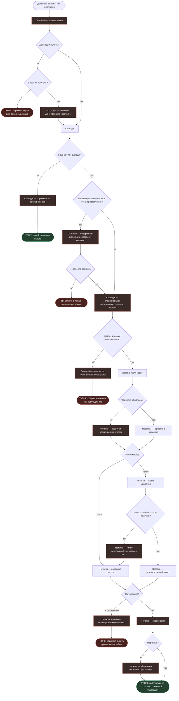
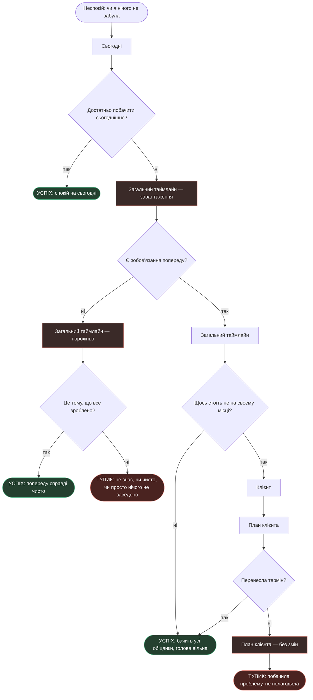
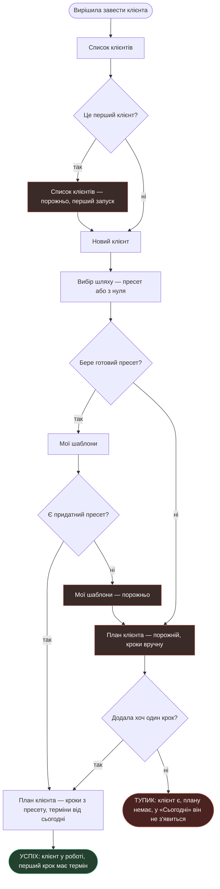

# User flows

Чернетка 2026-09-23. Екрани — зі [`sitemap.md`](sitemap.md), jobs —
з [`research/jtbd.md`](research/jtbd.md).

**Як читати:** `[прямокутник]` — екран або його стан · `{ромб}` — рішення
· `([овал])` — початок і кінець. Дії — підписи на стрілках, не вузли.

---

# MAIN JOB — «Мати пріоритет задач на сьогодні і швидко закрити найважливіше»

> Коли я між зустрічами і маю дві вільні хвилини, я хочу бачити, що зараз
> найважливіше з усього, і закрити саме це, щоб не розбиратися, за що хапатися.

Персона: **P1**, та, що переросла нотатки.

**Рішення в цьому потоці**

1. *Дані підтягнулись?* — якщо ні, дивимось на кеш.
2. *Є кеш на пристрої?* — §6 брифу обіцяє роботу офлайн. Кешу немає лише
   при першому запуску без мережі.
3. *Є що робити сьогодні?* — порожній день це нормальний результат, не збій.
4. *Після паузи накопичилась стіна прострочених?* — окрема гілка, бо це
   найризикованіший момент повернення.
5. *Перенесла терміни?* — масовий перенос, патерн `Reschedule` з Todoist.
6. *Видно, що саме найважливіше?* — **ключова розвилка цього job**, див. нижче.
7. *Чернетка зібралась?* — на першій зустрічі будувати нема з чого.
8. *Текст чи голос?* — вибір у кожному записі, не в налаштуваннях.
9. *Мова розпізнається на пристрої?* — відкрите питання §13 брифу.
10. *Підтвердила?* / *Мережа є?* — закриття справи й офлайн-черга.

**Стани**

- **Завантаження**, **офлайн із кешем** — перший екран не буває порожнім.
- **Порожньо на сьогодні** — має читатись як спокій, а не як поломка.
- **Повернення після паузи** — стіна прострочених із масовим переносом.
- **Порядок за терміновістю** — див. тупик нижче.
- **Чернетки немає**, **голос недоступний** — тихі відмови без помилок.
- **Збереження** і **локальна черга** — запис не втрачається без мережі.

**Тупики**

- **Перший запуск без мережі.** Єдиний гучний: показати нема чого.
- **Стіна прострочених лякає.** Людина відкрила після відпустки, побачила
  сорок пунктів і вийшла. Job провалено ще до вибору справи.
- **Обирає навмання.** «Сьогодні» впорядковує за **терміновістю**, а job
  просить **найважливіше**. Це не одне й те саме: прострочена дрібниця
  стоятиме вище за важливу розмову, що має відбутися сьогодні.
- **Незавершена чернетка.** Перервали на півдорозі, запис висить.

> ### Розрив, який виявив цей потік
>
> Job каже «найважливіше». Модель даних знає тільки **термін**: у сутності
> «Крок плану» є `due_date`, і `Сьогодні` групує за ним — прострочене,
> сьогоднішнє, зустрічі.
>
> **Ваги в нас немає ніде.** Ні поля, ні правила, ні jobs, які б її вимагали.
> Поки цього немає, продукт відповідає на питання «що горить», а не «що
> найважливіше» — і гілка `TOP --> ні` лишається відкритою.
>
> Поля не додаю: жоден підкріплений job пріоритету не просить, а ручне
> проставляння ваги — це робота, яку фахівець робитиме замість своєї роботи.
> Рішення за вами, питання винесене в `sitemap.md`.

---

# R2 — «Пам'ятати, що я кому пообіцяла»

> Коли я пообіцяла різним людям різні речі до різних дат, я хочу тримати всі
> обіцянки перед очима, щоб не носити чужі дати у своїй голові.

Персона: **P1**. Статус: рішення власника.

**Рішення в цьому потоці**

1. *Достатньо побачити сьогоднішнє?* — «Сьогодні» це один день, а обіцянки
   розкидані по тижнях. Саме тут виникає потреба в ширшому вікні.
2. *Є зобов'язання попереду?* — порожній горизонт неоднозначний.
3. *Це тому, що все зроблено?* — людина має відповісти собі сама, бо система
   відповіді не дає.
4. *Щось стоїть не на своєму місці?* — перегляд переходить у правку.
5. *Перенесла термін?* — вихід без дії лишає проблему на місці.

**Стани**

- **Завантаження** горизонту — даних більше, ніж у «Сьогодні».
- **Порожньо** — головна проблема цього потоку, див. тупик.
- **План без змін** — вихід без збереження.

**Тупики**

- **Неоднозначна порожнеча.** Порожній горизонт означає або «все зроблено»,
  або «нічого не заведено». Це **той самий корінь**, що й «клієнт без плану»
  з `sitemap.md`: об'єкт без кроків невидимий скрізь, і його відсутність
  неможливо відрізнити від порядку.
- **Побачила й не полагодила.** Помітила зсунутий термін, відкрила план,
  відволіклась. Job формально виконано — обіцянки побачила, — а спокою немає.

---

# R1 — «Переграти план, а не заводити новий»

> Коли клієнт посеред роботи передумав, я хочу змінити те, що попереду,
> щоб не заводити ще один окремий план і не тримати в голові, який із них
> тепер чинний.

Персона: **немає**. Ключова ставка продукту без знайденого носія.

**Рішення в цьому потоці**

1. *Що робить із кроком?* — три джерела: викинути, скласти вручну, узяти
   з іншого шаблону.
2. *Є придатний шаблон?* — у новачка власних шаблонів немає за визначенням.
3. *Ще зміни?* — петля: перебудова це серія дій, не одна.
4. *Підтвердила перебудову?* — вхід і вихід із режиму свідомі.

**Стани**

- **Пройдене замкнене** — правило, не помилка. Так само зроблено
  в CoachAccountable.
- **Шаблонів немає** — падаємо в ручне складання, не в глухий кут.
- **План без змін** — вихід без підтвердження нічого не ламає.

**Тупик**

- **Вийшла, не підтвердивши.** Клієнт передумав, план старий, робота йде
  не тим шляхом. Небезпечно тим, що виглядає нормально: жодної помилки
  на екрані немає.

---

# R7 — «Почати сьогодні, а не через тиждень»

> Коли я нарешті беруся навести лад у своїх клієнтах, я хочу почати цього ж
> вечора, щоб не витратити тиждень на налаштування й не кинути на півдорозі.

Персона: **[?]**. Закриває найризикованішу гіпотезу H4 — порожній старт.

**Рішення в цьому потоці**

1. *Це перший клієнт?* — перший запуск окремий стан, не той самий порожній список.
2. *Бере готовий пресет?* — рівноправна розвилка, як у Universe
   (`скрін: mobbin-search-universe-template-or-start-blank`), а не «пропустити».
3. *Є придатний пресет?* — власних шаблонів на старті немає, лишаються
   готові пресети продукту.
4. *Додала хоч один крок?* — точка, де людина або входить у продукт, або ні.

**Стани**

- **Перший запуск** — найризикованіший екран продукту, гіпотеза H4.
- **План порожній, кроки вручну** — стан, з якого легко піти нічого не зробивши.
- **Шаблонів немає** — у новачка їх немає за визначенням.

**Тупик**

- **Клієнт без плану.** Найтихіший збій у продукті: людина завела клієнта,
  не додала жодного кроку — і він **ніколи не з'явиться в «Сьогодні»**,
  бо там показуються кроки з термінами.

---

# Що видно з усіх чотирьох

**Один тупик повторюється тричі.** Клієнт або обіцянка без кроку з терміном
невидимі скрізь: у MAIN JOB, у R2 (порожній горизонт) і в R7 (клієнт без плану).
Це не край сценарію, а дірка в моделі — об'єкт може існувати в стані,
у якому продукт про нього мовчить.

**Чотири з шести тупиків мовчазні.** Ні в «клієнті без плану», ні
в «незавершеній чернетці», ні в «вийшла, не підтвердивши», ні в «побачила
й не полагодила» на екрані немає жодної помилки. Усе виглядає справним.

**Новий розрив, якого не було в попередній версії.** Переформульований
main job просить **найважливіше**, а модель знає тільки **термін**. Поки ваги
немає, продукт відповідає на інше питання, ніж ставить job.
