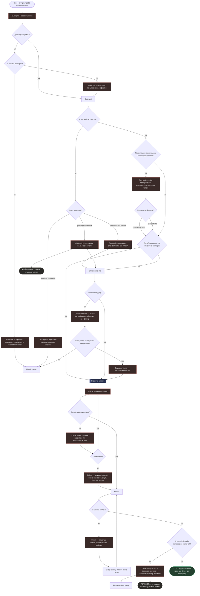
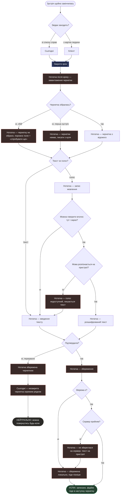
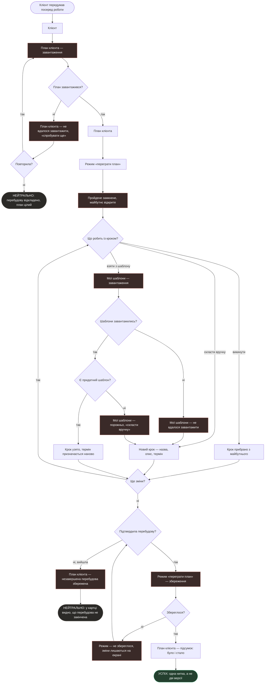
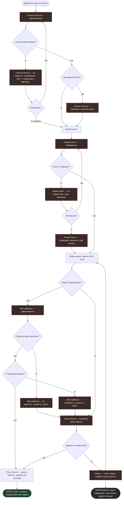
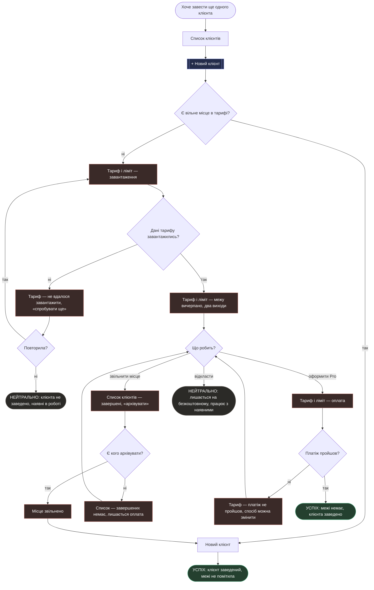

# User flows

Чернетка 2026-10-04. Екрани — зі [`sitemap.md`](sitemap.md), jobs —
з [`research/jtbd.md`](research/jtbd.md).

**Як читати**

| Форма | Значення |
|---|---|
| `[прямокутник]` | екран або його стан; назва збігається зі `sitemap.md` |
| `[[подвійна рамка]]` | **дія**, не екран. Виконується з екрана, власної сторінки не має |
| `{ромб}` | точка рішення |
| `([овал])` | початок, успіх або тупик |

Кольором: червоне — стани відмови, зелене — успіх, сіре — нейтральний вихід.

## Правило виходу

**Кожен стан відмови має вихід.** Запроваджено 2026-10-04 після критики:
тупики лікувалися безсистемно — у MAIN картка мала повтор, а в R1 план не мав;
R5 мав офлайн-чергу, а R7 не мав. Правило одне на всі потоки:

| Тип відмови | Обов'язковий вихід |
|---|---|
| Не завантажилось | Повтор, а якщо є кеш — показати його з позначкою |
| Не збереглося | Локальне збереження; набране не зникає з екрана |
| Порожньо | Причина плюс дія, якою це виправити |
| Людина перервалась | Незавершене лишається видимим, щоб до нього повернутись |

Кінець, де людина свідомо вийшла, не є тупиком: тупик — це коли продукт
не дав вибору. Такі кінці позначені як **нейтральні**, не червоні.

---

# MAIN JOB — «На чому ми зупинились і що далі»

> Коли я веду клієнта вже кілька місяців, я хочу в будь-який момент бачити,
> на чому ми зупинились і що я маю зробити далі, щоб не починати кожну
> зустріч із пригадування.

Персона: **P1**, та, що переросла нотатки.

```mermaid
flowchart TD
    START(["Скоро зустріч, треба зорієнтуватись"]) --> LOAD["Сьогодні — завантаження"]
    LOAD --> SYNC{"Дані підтягнулись?"}
    SYNC -->|ні| CACHE{"Є кеш на пристрої?"}
    CACHE -->|так| STALE["Сьогодні — кешовані дані, позначка «офлайн»"]
    CACHE -->|ні| COLD["Сьогодні — офлайн і порожньо: пояснення + «завести клієнта»"]
    COLD --> NEW["Новий клієнт"]
    SYNC -->|так| TODAY["Сьогодні"]
    STALE --> TODAY
    TODAY --> ANY{"Є що робити сьогодні?"}
    ANY -->|ні| WHY{"Чому порожньо?"}
    WHY -->|клієнтів ще немає| FIRST["Сьогодні — порожньо: «завести першого клієнта»"]
    FIRST --> NEW
    WHY -->|є клієнти без планів| GAPS["Сьогодні — порожньо, але N клієнтів без плану"]
    GAPS --> LIST
    WHY -->|усе під контролем| CALM["Сьогодні — порожньо: «на сьогодні нічого»"]
    CALM --> REST(["НЕЙТРАЛЬНО: спокій, нічого не забуто"])
    CALM --> LIST
    ANY -->|так| PILE{"Після паузи накопичилась стіна прострочених?"}
    PILE -->|так| BACK["Сьогодні — стіна прострочених, «перенести все» одним тапом"]
    BACK --> RESCH{"Що робить зі стіною?"}
    RESCH -->|перенесла все| INLIST
    RESCH -->|пропустила| INLIST
    PILE -->|ні| INLIST{"Потрібна людина є в списку на сьогодні?"}
    INLIST -->|так| OPEN
    INLIST -->|ні| LIST["Список клієнтів"]
    LIST --> FOUND{"Знайшла людину?"}
    FOUND -->|так| OPEN[["Відкрити клієнта"]]
    FOUND -->|ні| NOTFOUND["Список клієнтів — нічого не знайшлось, підказка про фільтр"]
    NOTFOUND --> PAUSED{"Може, вона на паузі або завершена?"}
    PAUSED -->|так| ARCHIVE["Список клієнтів — показані завершені"]
    ARCHIVE --> OPEN
    PAUSED -->|ні| NEW
    OPEN --> CLOAD["Клієнт — завантаження"]
    CLOAD --> CERR{"Картка завантажилась?"}
    CERR -->|ні| ERROR["Клієнт — не вдалося завантажити, «спробувати ще»"]
    ERROR --> RETRY{"Повторила?"}
    RETRY -->|так| CLOAD
    RETRY -->|ні| CACHED["Клієнт — кешована копія, позначка «дані можуть бути застарілі»"]
    CACHED --> CARD
    CERR -->|так| CARD["Клієнт"]
    CARD --> HASPLAN{"У клієнта є план?"}
    HASPLAN -->|ні| NOPLAN["Клієнт — плану ще немає, «обрати шлях роботи»"]
    NOPLAN --> PATH["Вибір шляху: пресет або з нуля"]
    PATH --> CARD
    HASPLAN -->|так| HIST{"У картці є історія попередніх зустрічей?"}
    HIST -->|ні| NOHIST["Клієнт — хронологія порожня: причина + «записати першу нотатку»"]
    NOHIST --> NOTE["Нотатка після кроку"]
    NOHIST --> PARTIAL(["ЧАСТКОВО: план видно, контексту розмов немає"])
    HIST -->|так| OK(["УСПІХ: видно поточний крок, що було і що попереду"])

    classDef state fill:#3a2a28,stroke:#E08A80,color:#ffffff
    classDef act fill:#242c4a,stroke:#8A97F0,color:#ffffff
    classDef neutral fill:#2b2a27,stroke:#6E6862,color:#ffffff
    classDef ok fill:#24402f,stroke:#5FBF92,color:#ffffff
    class LOAD,STALE,COLD,FIRST,GAPS,CALM,BACK,NOTFOUND,ARCHIVE,CLOAD,ERROR,CACHED,NOPLAN,NOHIST state
    class OPEN act
    class PARTIAL,REST neutral
    class OK ok
```

**Рішення в цьому потоці**

1. *Дані підтягнулись?* — якщо ні, дивимось на кеш.
2. *Є кеш на пристрої?* — §6 брифу обіцяє роботу офлайн. Кешу немає лише
   при першому запуску без мережі.
3. *Є що робити сьогодні?* — порожній день це **нормальний результат**,
   не збій. Але порожнеча двозначна, тому одразу наступне питання.
4. *Чому порожньо?* — три різні причини з трьома різними виходами, див. нижче.
5. *Після паузи накопичилась стіна прострочених?* — повернення після відпустки
   може обірвати шлях ще до пошуку клієнта.
6. *Потрібна людина є в списку на сьогодні?* — короткий шлях в один тап
   проти довгого у два.
7. *Знайшла людину?* — пошук у списку.
8. *Може, вона на паузі або завершена?* — за замовчуванням показуємо активних,
   тож завершений клієнт у пошуку не з'явиться.
9. *Картка завантажилась?* — **окремо від офлайну**: тут сервер відповів
   помилкою, а не мережа зникла.
10. *Повторила?* — помилка має давати другу спробу, а не глухий кут.
11. *У клієнта є план?* — клієнт може існувати без плану.
12. *У картці є історія попередніх зустрічей?* — **ядро цього job**, див. нижче.

**Стани**

- **Порожньо на сьогодні** — три варіанти з різним змістом, не один
  порожній екран. Детально нижче.
- **Завантаження** списку й картки — два різні, бо різні за тривалістю.
- **Офлайн із кешем** — показуємо з позначкою, не ховаємо.
- **Повернення після паузи** — стіна прострочених із масовим переносом.
- **Нічого не знайшлось** — найчастіша причина не помилка пошуку, а те,
  що клієнт не активний.
- **Показані завершені** — знятий фільтр, не окремий екран.
- **Не вдалося завантажити** — єдина справжня помилка в потоці.
- **Плану ще немає** — картка є, орієнтуватись нема по чому.
- **Хронологія порожня** — найтихіший стан у всьому потоці.

**Виходи з відмов** (правило від 2026-10-04)

| Було тупиком | Тепер |
|---|---|
| Перший запуск без мережі | Екран пояснює, що офлайн, і пропонує завести клієнта локально |
| Стіна прострочених | «Перенести все» одним тапом; стіну можна **пропустити** і йти до клієнта |
| Помилка картки | Повтор, а при відмові — кешована копія з позначкою про давність |
| Людини в базі немає | Веде в «Новий клієнт» |
| Хронологія порожня | Пояснює причину й веде до першої нотатки; план лишається видимим |

Останній випадок лишається **частковим успіхом**, не провалом: план людина
бачить, контексту розмов — ні. Позначено сірим, бо продукт тут зробив усе,
що міг із наявних даних.

> ### Порожній день — три різні порожнечі
>
> Додано 2026-10-04. Раніше порожнього стану «Сьогодні» не було в жодному
> потоці, хоча це найчастіший екран продукту.
>
> Головна пастка в тому, що **порожньо означає три різні речі**, і плаский
> екран «на сьогодні нічого» приховав би дві з них:
>
> | Чому порожньо | Що показуємо | Куди веде |
> |---|---|---|
> | Клієнтів ще немає | «Завести першого клієнта» | Новий клієнт |
> | Є клієнти **без планів** | «На сьогодні нічого, але N клієнтів без плану» | Список клієнтів |
> | Усе під контролем | «На сьогодні нічого» | Спокій, або до списку клієнтів |
>
> Другий рядок закриває дефект 4.4 з критики: **клієнт без кроків невидимий
> скрізь**, і людина вважає, що все гаразд, поки продукт мовчить. Тепер
> порожній день сам про це каже — це єдине місце, де така підказка доречна,
> бо саме тут людина питає «а що в мене сьогодні».
>
> Третій варіант має **два виходи**: спокій як самостійний результат
> і перехід до клієнтів. Порожнє «Сьогодні» не повинно бути глухим кутом —
> main job можна закрити й без жодної справи на сьогодні.

> ### Залежність, яку виявив цей потік
>
> Main job просить побачити, **на чому ми зупинились**. План відповідає тільки
> на «що далі» — він показує кроки й терміни. На «що було» відповідає
> **хронологія**, а вона наповнюється лише нотатками після зустрічей.
>
> Отже **main job виконується тільки тоді, коли раніше виконувався R5**.
> Фахівець, який три місяці не писав нотаток, відкриє картку й побачить
> список кроків без жодного сліду розмов.
>
> Наслідок для проєктування: стан «хронологія порожня» не можна малювати
> як звичайний empty. Він має пояснювати причину й вести до першого запису,
> інакше продукт мовчки не виконує свою головну обіцянку.

---

# R5 — «Записати, поки не забула»

> Коли зустріч щойно закінчилась і все ще свіже в голові, я хочу відразу
> записати головне, щоб за тиждень не згадувати, про що ми домовились.

Персона: **[?]** — підкріплено цитатою, носія не визначено.
Саме цей job наповнює хронологію, від якої залежить main job.

```mermaid
flowchart TD
    FIN(["Зустріч щойно закінчилась"]) --> WHERE{"Звідки заходить?"}
    WHERE -->|зі списку справ| TODAY["Сьогодні"]
    WHERE -->|з картки людини| CARD["Клієнт"]
    TODAY --> CLOSE[["Закрити крок"]]
    CARD --> CLOSE
    CLOSE --> DLOAD["Нотатка після кроку — завантаження чернетки"]
    DLOAD --> DOK{"Чернетка зібралась?"}
    DOK -->|ні, збій| DERR["Нотатка — чернетку не зібрано, порожнє поле + «спробувати ще»"]
    DERR --> INPUT
    DOK -->|ні, перша зустріч| BLANK["Нотатка — чернетки немає, писати з нуля"]
    DOK -->|так| FILLED["Нотатка — чернетка з відомого"]
    BLANK --> INPUT
    FILLED --> INPUT{"Текст чи голос?"}
    INPUT -->|текст| TYPE["Нотатка — введення тексту"]
    INPUT -->|голос| REC["Нотатка — запис мовлення"]
    REC --> ALONE{"Можна говорити вголос тут і зараз?"}
    ALONE -->|ні| TYPE
    ALONE -->|так| LANG{"Мова розпізнається на пристрої?"}
    LANG -->|ні| FALL["Нотатка — голос недоступний, лишається текст"]
    FALL --> TYPE
    LANG -->|так| DEC["Нотатка — розшифрований текст"]
    TYPE --> CONF{"Підтвердила?"}
    DEC --> CONF
    CONF -->|ні, перервали| KEPT["Нотатка збережена чернеткою"]
    KEPT --> PEND["Сьогодні — незакрита чернетка окремим рядком"]
    PEND --> BACKTO(["НЕЙТРАЛЬНО: можна повернутись будь-коли"])
    CONF -->|так| SAVE["Нотатка — збереження"]
    SAVE --> NET{"Мережа є?"}
    NET -->|ні| QUEUE["Нотатка — збережена локально, піде пізніше"]
    NET -->|так| SRV{"Сервер прийняв?"}
    SRV -->|ні| SERR["Нотатка — не збереглася на сервері, текст на пристрої"]
    SERR --> QUEUE
    SRV -->|так| OK(["УСПІХ: записано, фідбек піде в наступну чернетку"])
    QUEUE --> OK

    classDef state fill:#3a2a28,stroke:#E08A80,color:#ffffff
    classDef act fill:#242c4a,stroke:#8A97F0,color:#ffffff
    classDef neutral fill:#2b2a27,stroke:#6E6862,color:#ffffff
    classDef ok fill:#24402f,stroke:#5FBF92,color:#ffffff
    class DLOAD,DERR,BLANK,FALL,SAVE,QUEUE,SERR,KEPT,PEND state
    class CLOSE act
    class BACKTO neutral
    class OK ok
```

**Рішення в цьому потоці**

1. *Звідки заходить?* — два входи: рядок у «Сьогодні» або картка клієнта.
2. *Чернетка зібралась?* — на першій зустрічі будувати нема з чого.
3. *Текст чи голос?* — вибір у кожному записі, не в налаштуваннях.
4. *Можна говорити вголос тут і зараз?* — салон, зал, коворкінг. Голос
   відпадає не через техніку, а через людей поруч.
5. *Мова розпізнається на пристрої?* — відкрите питання §13 брифу.
6. *Підтвердила?* — чернетка закривається одним тапом.
7. *Мережа є?* / *Сервер прийняв?* — дві різні відмови з однаковим виходом:
   текст лишається на пристрої.

**Дія, а не екран**

- **«Закрити крок»** — головна дія «Сьогодні», живе на рядку списку.
  Власної сторінки не має: тап по ній відкриває «Нотатку після кроку».
  У `sitemap.md` описана в розділі «Головна дія».

**Стани**

- **Завантаження чернетки** — система збирає її з кроку, плану й минулого фідбеку.
- **Чернетки немає** — перша зустріч, порожнє поле замість чорновика.
- **Голос недоступний** — тиха відмова в текст, без екрана помилки.
- **Збереження**, **локальна черга**, **не збереглася** — три стани запису.
  Жоден не втрачає набраний текст.

**Виходи з відмов**

- **Незавершена чернетка** більше не зникає з очей: лишається в «Сьогодні»
  окремим рядком, доки не закрита. Раніше це був найтихіший тупик — запис
  існував, але про нього забували, і саме він не потрапляв у хронологію,
  від якої залежить main job.
- **Чернетка не зібралась через збій** — тепер окремо від «перша зустріч».
  Обидва ведуть до поля вводу, але перший пропонує повтор.

---

# R1 — «Переграти план, а не заводити новий»

> Коли клієнт посеред роботи передумав, я хочу змінити те, що попереду,
> щоб не заводити ще один окремий план і не тримати в голові, який із них
> тепер чинний.

Персона: **немає**. Ключова ставка продукту без знайденого носія.

```mermaid
flowchart TD
    TRIG(["Клієнт передумав посеред роботи"]) --> CARD["Клієнт"]
    CARD --> PLOAD["План клієнта — завантаження"]
    PLOAD --> PERR{"План завантажився?"}
    PERR -->|ні| PFAIL["План клієнта — не вдалося завантажити, «спробувати ще»"]
    PFAIL --> PRETRY{"Повторила?"}
    PRETRY -->|так| PLOAD
    PRETRY -->|ні| LATER(["НЕЙТРАЛЬНО: перебудову відкладено, план цілий"])
    PERR -->|так| PLAN["План клієнта"]
    PLAN --> MODE["Режим «переграти план»"]
    MODE --> SPLIT["Пройдене замкнене, майбутнє відкрите"]
    SPLIT --> WHAT{"Що робить із кроком?"}
    WHAT -->|викинути| DROP["Крок прибрано з майбутнього"]
    WHAT -->|скласти вручну| MANUAL["Новий крок — назва, опис, термін"]
    WHAT -->|взяти з шаблону| TLOAD["Мої шаблони — завантаження"]
    TLOAD --> TOK{"Шаблони завантажились?"}
    TOK -->|ні| TERR["Мої шаблони — не вдалося завантажити"]
    TERR --> MANUAL
    TOK -->|так| HASTPL{"Є придатний шаблон?"}
    HASTPL -->|так| PICK["Крок узято, термін призначається наново"]
    HASTPL -->|ні| NOTPL["Мої шаблони — порожньо, «скласти вручну»"]
    NOTPL --> MANUAL
    DROP --> MORE{"Ще зміни?"}
    MANUAL --> MORE
    PICK --> MORE
    MORE -->|так| WHAT
    MORE -->|ні| CONF{"Підтвердила перебудову?"}
    CONF -->|ні, вийшла| DRAFT["План клієнта — незавершена перебудова збережена"]
    DRAFT --> RESUME(["НЕЙТРАЛЬНО: у картці видно, що перебудова не закінчена"])
    CONF -->|так| SAVING["Режим «переграти план» — збереження"]
    SAVING --> SRV{"Збереглося?"}
    SRV -->|ні| SERR["Режим — не збереглося, зміни лишаються на екрані"]
    SERR --> CONF
    SRV -->|так| SUM["План клієнта — підсумок: було і стало"]
    SUM --> OK(["УСПІХ: одна нитка, а не дві версії"])

    classDef state fill:#3a2a28,stroke:#E08A80,color:#ffffff
    classDef neutral fill:#2b2a27,stroke:#6E6862,color:#ffffff
    classDef ok fill:#24402f,stroke:#5FBF92,color:#ffffff
    class PLOAD,PFAIL,SPLIT,TLOAD,TERR,NOTPL,DRAFT,SAVING,SERR state
    class LATER,RESUME neutral
    class OK ok
```

**Рішення в цьому потоці**

1. *План завантажився?* — перебудова неможлива без того, що перебудовувати.
2. *Що робить із кроком?* — три джерела: викинути, скласти вручну, узяти
   з іншого шаблону.
3. *Є придатний шаблон?* — у новачка власних шаблонів немає за визначенням.
4. *Ще зміни?* — петля: перебудова це серія дій, не одна.
5. *Підтвердила перебудову?* — вхід і вихід із режиму свідомі.
6. *Збереглося?* — відмова повертає до підтвердження, **не викидає зміни**.

**Стани**

- **Завантаження плану** і **не вдалося завантажити** — перед входом у режим.
- **Пройдене замкнене** — правило, не помилка. Так само в CoachAccountable.
- **Шаблонів немає** — падаємо в ручне складання, не в глухий кут.
- **План без змін** — вихід без підтвердження нічого не ламає.
- **Збереження** і **не збереглося** — набрана перебудова лишається на екрані,
  щоб не складати її вдруге.

**Виходи з відмов**

- **План не завантажився** — тепер є повтор, як у MAIN для картки. Раніше
  цієї гілки не було: пряма непослідовність між потоками.
- **Вийшла, не підтвердивши** — перебудова зберігається чернеткою, у картці
  видно, що вона не закінчена. Раніше зміни зникали, і найгірше було те,
  що це виглядало нормально.
- **Шаблони не завантажились** — падаємо в ручне складання, не в глухий кут.

---

# R7 — «Почати сьогодні, а не через тиждень»

> Коли я нарешті беруся навести лад у своїх клієнтах, я хочу почати цього ж
> вечора, щоб не витратити тиждень на налаштування й не кинути на півдорозі.

Персона: **[?]**. Закриває найризикованішу гіпотезу H4 — порожній старт.

```mermaid
flowchart TD
    GO(["Вирішила завести клієнта"]) --> LLOAD["Список клієнтів — завантаження"]
    LLOAD --> LERR{"Список завантажився?"}
    LERR -->|ні| LFAIL["Список клієнтів — не вдалося, «спробувати ще» + «працювати офлайн»"]
    LFAIL --> LRETRY{"Повторила?"}
    LRETRY -->|так| LLOAD
    LRETRY -->|ні, офлайн| NEW
    LERR -->|так| ISFIRST{"Це перший клієнт?"}
    ISFIRST -->|так| FIRSTRUN["Список клієнтів — порожньо, перший запуск"]
    ISFIRST -->|ні| NEW["Новий клієнт"]
    FIRSTRUN --> NEW
    NEW --> SAVE1["Новий клієнт — збереження"]
    SAVE1 --> SRV{"Клієнт створився?"}
    SRV -->|ні| CERR["Новий клієнт — не збереглося, поля заповнені"]
    CERR --> AGAIN{"Повторила?"}
    AGAIN -->|так| SAVE1
    AGAIN -->|ні| LOCAL["Новий клієнт — збережено локально, піде пізніше"]
    LOCAL --> PATH
    SRV -->|так| PATH["Вибір шляху: пресет або з нуля"]
    PATH --> CHOICE{"Бере готовий пресет?"}
    CHOICE -->|так| TLOAD["Мої шаблони — завантаження"]
    TLOAD --> TOK{"Пресети завантажились?"}
    TOK -->|ні| TERR["Мої шаблони — не вдалося, «скласти з нуля»"]
    TERR --> SCRATCH
    TOK -->|так| ANY{"Є придатний пресет?"}
    ANY -->|так| APPLIED["План клієнта — кроки з пресету, терміни від сьогодні"]
    ANY -->|ні| NOTPL["Мої шаблони — порожньо, «скласти з нуля»"]
    NOTPL --> SCRATCH
    CHOICE -->|ні| SCRATCH["План клієнта — порожній, кроки вручну"]
    SCRATCH --> ADDED{"Додала хоч один крок?"}
    ADDED -->|так| APPLIED
    ADDED -->|ні| NOSTEP["Клієнт — плану немає, «обрати шлях роботи»"]
    NOSTEP --> PATH
    NOSTEP --> PAUSE(["НЕЙТРАЛЬНО: клієнт заведений, план можна додати пізніше"])
    APPLIED --> OK(["УСПІХ: клієнт у роботі, перший крок має термін"])

    classDef state fill:#3a2a28,stroke:#E08A80,color:#ffffff
    classDef neutral fill:#2b2a27,stroke:#6E6862,color:#ffffff
    classDef ok fill:#24402f,stroke:#5FBF92,color:#ffffff
    class LLOAD,LFAIL,FIRSTRUN,SAVE1,CERR,LOCAL,TLOAD,TERR,SCRATCH,NOTPL,NOSTEP state
    class PAUSE neutral
    class OK ok
```

**Рішення в цьому потоці**

1. *Список завантажився?* — на першому запуску ця помилка найдорожча:
   людина ще нічого не вклала й легко йде.
2. *Це перший клієнт?* — перший запуск окремий стан, не той самий порожній
   список.
3. *Клієнт створився?* — відмова не має стирати введене.
4. *Бере готовий пресет?* — рівноправна розвилка, як у Universe
   (`скрін: mobbin-search-universe-template-or-start-blank`), а не «пропустити».
5. *Є придатний пресет?* — власних шаблонів на старті немає, лишаються
   готові пресети продукту.
6. *Додала хоч один крок?* — точка, де людина або входить у продукт, або ні.

**Стани**

- **Завантаження списку** і **не вдалося завантажити** — на першому запуску
  це найдорожча помилка в усьому продукті.
- **Перший запуск** — найризикованіший екран, гіпотеза H4.
- **Збереження клієнта** і **не збереглося** — поля лишаються заповненими.
- **План порожній, кроки вручну** — стан, з якого легко піти нічого не зробивши.
- **Шаблонів немає** — у новачка їх немає за визначенням.

**Виходи з відмов**

- **Список не завантажився** — повтор плюс можливість працювати офлайн.
  На першому запуску це найдорожча помилка: людина ще нічого не вклала.
- **Клієнт не зберігся** — після повтору зберігаємо локально, як це робить
  R5. Раніше тут була нескінченна петля в той самий сервер.
- **Клієнт без плану** — веде до «Вибору шляху». Цей вихід уже існував
  у MAIN, а в R7 його не було: той самий стан мав різну долю в двох потоках.

---

# R6 — «Не платити як велика практика»

> Коли в мене п'ять клієнтів, а не п'ятдесят, я хочу платити відповідно
> до цього, щоб інструмент не з'їдав дохід, якого ще немає.

Персона: **P3**, та, що вже платить за інший інструмент і незадоволена.
Єдиний потік, породжений secondary-персоною.

```mermaid
flowchart TD
    GO(["Хоче завести ще одного клієнта"]) --> LIST["Список клієнтів"]
    LIST --> ADD[["+ Новий клієнт"]]
    ADD --> SLOT{"Є вільне місце в тарифі?"}
    SLOT -->|так| NEW["Новий клієнт"]
    NEW --> OK1(["УСПІХ: клієнт заведений, межі не помітила"])
    SLOT -->|ні| TLOAD["Тариф і ліміт — завантаження"]
    TLOAD --> TOK{"Дані тарифу завантажились?"}
    TOK -->|ні| TERR["Тариф — не вдалося завантажити, «спробувати ще»"]
    TERR --> TRETRY{"Повторила?"}
    TRETRY -->|так| TLOAD
    TRETRY -->|ні| BLOCK(["НЕЙТРАЛЬНО: клієнта не заведено, наявні в роботі"])
    TOK -->|так| LIMIT["Тариф і ліміт — межу вичерпано, два виходи"]
    LIMIT --> HOW{"Що робить?"}
    HOW -->|звільнити місце| ARCH["Список клієнтів — завершені, «архівувати»"]
    ARCH --> HASDONE{"Є кого архівувати?"}
    HASDONE -->|так| FREED["Місце звільнено"]
    FREED --> NEW
    HASDONE -->|ні| NOONE["Список — завершених немає, лишається оплата"]
    NOONE --> HOW
    HOW -->|оформити Pro| PAY["Тариф і ліміт — оплата"]
    PAY --> PRES{"Платіж пройшов?"}
    PRES -->|ні| PERR["Тариф — платіж не пройшов, спосіб можна змінити"]
    PERR --> HOW
    PRES -->|так| OK2(["УСПІХ: межі немає, клієнта заведено"])
    HOW -->|відкласти| STAY(["НЕЙТРАЛЬНО: лишається на безкоштовному, працює з наявними"])

    classDef state fill:#3a2a28,stroke:#E08A80,color:#ffffff
    classDef act fill:#242c4a,stroke:#8A97F0,color:#ffffff
    classDef neutral fill:#2b2a27,stroke:#6E6862,color:#ffffff
    classDef ok fill:#24402f,stroke:#5FBF92,color:#ffffff
    class TLOAD,TERR,LIMIT,ARCH,NOONE,PAY,PERR,FREED state
    class ADD act
    class BLOCK,STAY neutral
    class OK1,OK2 ok
```

**Рішення в цьому потоці**

1. *Є вільне місце в тарифі?* — перевірка відбувається **при спробі додати**,
   а не на окремому екрані. Людина не шукає тариф — тариф знаходить її.
   Це закриває дефект із критики: шлях до екрана «Тариф» ніде не був визначений.
2. *Дані тарифу завантажились?* — платіжний екран теж має помилку.
3. *Що робить?* — **два виходи, не один.** Ключове рішення цього потоку.
4. *Є кого архівувати?* — у новачка завершених клієнтів може не бути.
5. *Платіж пройшов?* — відмова не викидає з потоку, дає змінити спосіб.

**Чому два виходи, а не тільки оплата**

§10 брифу ставить межу на **активних** клієнтах, не на всіх. Отже архівувати
завершеного — легальний спосіб звільнити місце, і ховати його було б нечесно.

Це коштує нам частини конверсії. Але P3 прийшла саме від того, що «ціна
не сходиться на малій практиці» — цитата Maria D. Продукт, який у цей момент
не лишає виходу, крім оплати, підтверджує її найгірший досвід із попереднім
інструментом.

**Стани**

- **Завантаження тарифу** і **помилка** — екран платний, мережа обов'язкова.
- **Межу вичерпано** — головний стан потоку. Має показувати обидва виходи
  одночасно, не ховати архівацію під «дрібним шрифтом».
- **Завершених немає** — порожній стан архіву: пояснює, що звільнити нема чого,
  і повертає до вибору.
- **Платіж не пройшов** — повертає до вибору способу, не в початок.

**Виходи з відмов**

Жодного тупика. Два нейтральні кінці: не заплатила через збій тарифу,
і свідомо відклала. В обох випадках наявні клієнти лишаються в роботі —
межа не ламає того, що вже працює.

---

# Що видно з усіх чотирьох

**Main job залежить від R5.** «На чому ми зупинились» бере відповідь
із хронології, а хронологію наповнюють нотатки. Якщо R5 не виконувався,
головний job не виконається — при цілком справному плані.

**Невидимість повторюється двічі.** Клієнт без плану (R7) і хронологія
без записів (MAIN) — один корінь: об'єкт існує, але продукт про нього мовчить,
бо порожній.

**Відмова збереження скрізь поводиться однаково** — набране лишається
на екрані або на пристрої. Це правило, а не властивість окремого екрана:
R5 кладе в чергу, R1 тримає зміни в режимі, R7 лишає поля заповненими.

**Тупиків більше немає.** Після правила виходу від 2026-10-04 кожен стан
відмови веде кудись: повтор, кеш, локальне збереження або видимий слід
незавершеного. Лишилось **п'ять нейтральних кінців** — людина свідомо вийшла,
і продукт їй цього не нав'язав.

**Найтихіші колишні тупики варті окремої пам'яті:** хронологія порожня,
клієнт без плану, незавершена чернетка, вийшла не підтвердивши перебудову.
На екрані не було жодної помилки, усе виглядало справним — саме тому вони
й не помічались.

**Голос має дві гілки відмови.** Технічну — мова не розпізнається офлайн
(§13 брифу). І людську — поруч люди. Друга спрацьовує частіше
й не лікується технікою.
